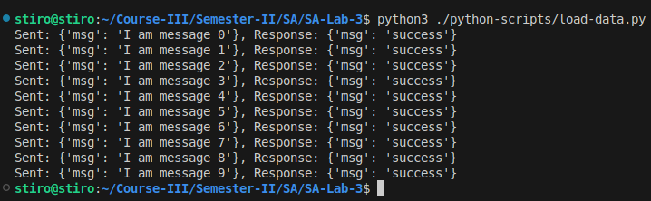

# SA-Lab-3

Author: Davyd Ilnytskyi

Додаткові: імплементація Config Service

---

### Setup hazelcast network
`docker network create --subnet=172.18.0.0/16 hazelcast-network`


###
```
pip install -r requirements.txt
```

### Setup hazelcast node
```
bash ./bash-scripts/setup-hazelcast.sh
```

### Setup Config, Facade, Logging, Message services
```
python3 ./python-scripts/setup.py
```


---

# Tasks

1. Запустити три екземпляри _logging service_, _hazelcast_
2. Записати 10 повідомлень через HTTP Post Facade-service

3. Показати які повідомлення отримав кожен з екземплярів _logging service_.


4. Через Facade Get прочитати повідомлення

5. Вбити один _loggigng service_ разом з _hazelcast node_

6. Перевірити, чи вдається прочитати повідомлення


Вдається отримати повідомлення, що розташовуються на двох інших нодах. Це відбувається, оскільки всі три ноди є окремими кластерами. 


---

# Додатковий функціонал системи
## **Config service**

```python
from fastapi import FastAPI, HTTPException
from configparser import ConfigParser
from typing import List
import uvicorn
from urllib.parse import urlparse
import sys

app = FastAPI()

def load_ips(file: str = "config.ini") -> dict:
    config = ConfigParser()
    config.read(file)
    ip_data = {}
    
    for section in config.sections():
        ip_data[section] = config.get(section, "ips").split(',')
    
    return ip_data

ip_registry = load_ips()

@app.get("/services/{service_name}", response_model=List[str])
def get_service_ips(service_name: str):
    if service_name in ip_registry:
        return ip_registry[service_name]
    raise HTTPException(status_code=404, detail="Service not found")

if __name__ == "__main__":
    host_url = urlparse(sys.argv[1])

    uvicorn.run(app, host=host_url.hostname, port=host_url.port)
```

**Фасад при початку роботи надсилає запит для отримання всіх ip**
```
...
def get_service_ips(service_name):
    try:
        response = requests.get(f"{config_server_url}/services/{service_name}")
        response.raise_for_status()
        return response.json()
    except requests.exceptions.RequestException as e:
        print(f"Error retrieving {service_name} IPs: {e}")
        return []

if __name__ == "__main__":
    host_url = urlparse(sys.argv[1])
    config_server_url = sys.argv[2]

    messages_urls = get_service_ips("messages-service")
    logging_urls = get_service_ips("logging-services")

    uvicorn.run(app, host=host_url.hostname, port=host_url.port)
...
```